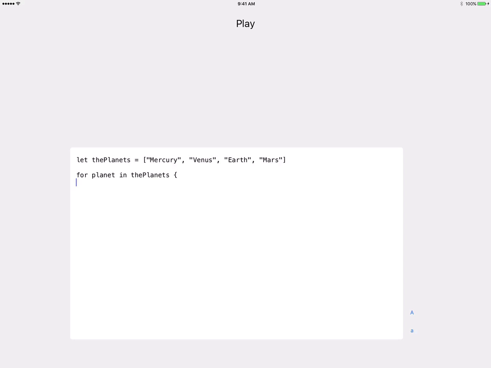

# DEPRECATED. Swift Playgrounds is an incredible app that is a joy to use. Download it from Apple here: https://www.apple.com/swift/playgrounds/


Play is an iPad client for the OS X Swift REPL.

## Overview

Play lets you write and run Swift code from your iPad. A small Node.js app runs on your Mac and opens up a single socket over which the iPad app and your Mac can exchange Swift code and code output. The Node side simply creates a Swift file, executes the file using `swift` in Terminal, and sends the output back to the iPad app.

## What you need

- An iPad with iOS 9.0+ and an external keyboard
- A Mac with OS X 10.10+, Xcode 7.1+, and Node.js

## What's in the box?



- 1 iPad app
- 1 Node.js app

## Installation

### Xcode

Play requires the Swift REPL to be installed and available via the terminal with the `swift` command.

### Node

Node can be installed with Homebrew using the following command:
```
brew install node
```
More information about Node.js can be found [here](https://nodejs.org/en/).

### Node packages

Play uses two node packages, [socket.io](https://github.com/socketio/socket.io) and [shell.js](https://github.com/shelljs/shelljs). Both packages can be installed with [npm](https://www.npmjs.com) using the following commands:
```
npm install socket.io
npm install shelljs
```

## Usage

### Starting the server

To start the Node server, open a Terminal window up to the Node folder and enter the following command:
```
node app.js
```

The socket will then open on port `1993` and should be ready to receive Swift code.

### Configuring the client

In `PSocket.swift`, replace the IP address with the wireless IP address of your Mac in the following line:

```swift
private let socket = SocketIOClient(socketURL: "http://10.0.1.50:1993", options: [])
```

This IP address can be found by going to the Network tab of System Preferences.

### Running Swift code

To run code from the iPad app, open the app on an iPad connected to the same Wifi network. Press `⌘ + R` to run.

The included `index.html` file has a javascript function `sendCode(testCode)` that you can use to easily send Swift code to the server for testing. `sendCode` takes one String of code and will cause the code's output to display in the Terminal window running the Node server. 

## What's coming up?

- Removing the physical keyboard requirement
- Saving snippets

## Credits

Play was designed by Sahand Nayebaziz.

## License

Play is released under the MIT license. See LICENSE for details.


